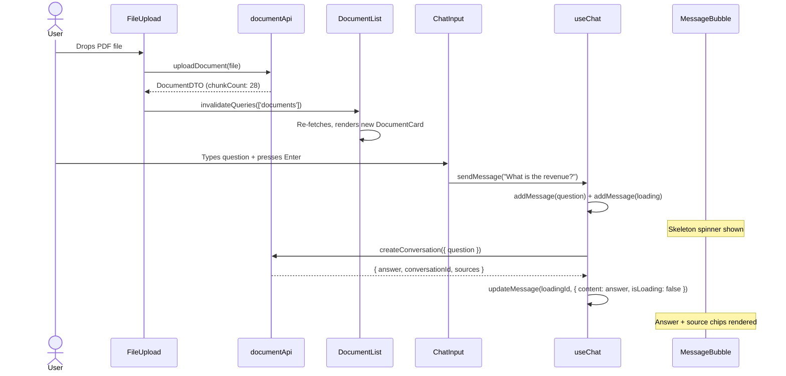

# ⚡ Docura Frontend: Component Reference Guide

> **Intelligence for Your Documents** — Component-level documentation for every React component in the Docura SPA. Intended for contributors, reviewers, and any developer extending the frontend.

---

## Table of Contents
1. [Architecture Overview](#1-architecture-overview)
2. [Feature: Chat](#2-feature-chat)
3. [Feature: Documents](#3-feature-documents)
4. [Shared UI Components](#4-shared-ui-components)
5. [Layout Components](#5-layout-components)
6. [Pages](#6-pages)
7. [Guards & Routing](#7-guards--routing)
8. [Component Interaction Flow](#8-component-interaction-flow)

---

## 1. Architecture Overview

The frontend follows a **Feature-Sliced Design (FSD)** pattern where each domain feature owns its components, hooks, and API calls. Shared, reusable UI components live in `components/ui/`. Pages are thin orchestration layers.

```
src/
├── features/              # Feature domains: chat, documents
│   ├── chat/
│   │   ├── components/    # ChatContainer, ChatInput, ConversationHistory, MessageBubble
│   │   └── hooks/         # useChat (business logic + store sync)
│   └── documents/
│       ├── components/    # DocumentList, DocumentCard, FileUpload, SearchContainer, SearchResultCard
│       └── api/           # documentApi.ts (all /api/documents/* calls)
│
├── components/
│   ├── layout/            # Navbar, Footer (app chrome)
│   ├── ui/                # ConfirmDialog, DocumentPreview, Logo, Skeleton (shared primitives)
│   └── ProtectedRoute.tsx # Auth guard for React Router
│
├── contexts/
│   └── AuthContext.tsx    # Global auth state (user, tokens, actions)
│
├── store/
│   └── chatStore.ts       # Zustand: messages[], conversationId, isLoading
│
├── services/
│   └── authService.ts     # HTTP layer for /api/auth (login, register, refresh, logout)
│
├── pages/                 # Route-level components (thin, delegate to features)
│   ├── HomePage.tsx
│   ├── LoginPage.tsx
│   ├── RegisterPage.tsx
│   ├── ChatPage.tsx
│   ├── DocumentsPage.tsx
│   ├── SearchPage.tsx
│   └── ProfilePage.tsx
│
├── types/                 # TypeScript interfaces: auth.ts, api.types.ts
├── hooks/                 # useKeyboardShortcuts.ts (global keyboard bindings)
├── utils/                 # toast.ts
└── constants/
    └── branding.ts        # Project name, slogan, colors constants
```

---

## 2. Feature: Chat

The chat feature handles the RAG conversation lifecycle — from sending a question to displaying streamed answers with source citations.

### `ChatContainer.tsx`
**Path:** `src/features/chat/components/ChatContainer.tsx`

The top-level orchestrator for the chat interface. Renders the conversation history panel and chat input. Subscribes to `useChatStore` for message state.

**Responsibilities:**
- Renders `ConversationHistory` in a sidebar panel.
- Renders the scrollable thread of `MessageBubble` components.
- Renders `ChatInput` anchored at the bottom.
- Automatically scrolls to bottom when new messages are added.

---

### `ConversationHistory.tsx`
**Path:** `src/features/chat/components/ConversationHistory.tsx`

Displays the sidebar list of all past conversation threads for the authenticated user.

**Responsibilities:**
- Calls `documentApi.getConversations()` to fetch the conversation list.
- Each item displays the conversation title (auto-generated from the first question).
- Clicking a conversation calls `useChat().loadConversation(id)`.
- Shows a delete button that calls `documentApi.deleteConversation(id)` and invalidates the list.

---

### `MessageBubble.tsx`
**Path:** `src/features/chat/components/MessageBubble.tsx`  
**Test:** `src/features/chat/components/MessageBubble.test.tsx`

Renders a single message — either a `QUESTION` or `ANSWER` type — with appropriate styling. For `ANSWER` messages, renders source citation chips.

**Props:**
```typescript
interface MessageBubbleProps {
  message: ChatMessage; // { id, type: 'question'|'answer', content, isLoading, sources? }
}
```

**Behaviour:**
- `type === 'question'` → Right-aligned bubble, user avatar icon.
- `type === 'answer'` → Left-aligned bubble, Docura logo icon. Renders markdown-safe content.
- `isLoading === true` → Shows animated `Skeleton` component while waiting for API.
- `sources` → Renders a row of clickable `DocumentPreview` chips showing source document name and similarity score.

---

### `ChatInput.tsx`
**Path:** `src/features/chat/components/ChatInput.tsx`  
**Test:** `src/features/chat/components/ChatInput.test.tsx`

The controlled textarea and submit button for typing new messages.

**Behaviour:**
- Pressing `Enter` (without Shift) submits the form.
- Pressing `Shift+Enter` inserts a newline.
- Disabled while `useChatStore.isLoading === true` to prevent double-submissions.
- Clears input field after successful submission.

---

### `useChat.ts` (Hook)
**Path:** `src/features/chat/hooks/useChat.ts`  
**Test:** `src/features/chat/hooks/useChat.test.tsx`

The primary hook for chat interactions. Bridges `documentApi`, `useChatStore`, and React Query mutations.

**Exported functions:**

| Function | Description |
|---|---|
| `sendMessage(content)` | Adds optimistic `QUESTION` + loading `ANSWER` to store, calls `documentApi.createConversation()` or `addMessageToConversation()`, then resolves loading state with real answer |
| `loadConversation(id)` | Calls `documentApi.getConversation(id)`, maps `ConversationMessage[]` to `ChatMessage[]`, syncs to `useChatStore` |

**Key test scenarios** (from `useChat.test.tsx`):
```typescript
// Test 1: sendMessage adds question + loading placeholder immediately
expect(useChatStore.getState().messages).toHaveLength(2);
expect(useChatStore.getState().messages[0].type).toBe('question');
expect(useChatStore.getState().messages[1].isLoading).toBe(true);

// Test 2: After API resolves, loading is replaced with real answer
expect(useChatStore.getState().messages[1].content).toBe('Hello from AI');
expect(useChatStore.getState().messages[1].isLoading).toBe(false);
```

---

## 3. Feature: Documents

### `FileUpload.tsx`
**Path:** `src/features/documents/components/FileUpload.tsx`

Drag-and-drop upload zone for document ingestion.

**Behaviour:**
- Accepts `.pdf`, `.docx`, `.txt` files.
- On drop/selection, calls `documentApi.uploadDocument(file)`.
- Shows upload progress indicator.
- On success, invalidates `['documents']` React Query cache, refreshing `DocumentList`.
- On error (413 size limit, unsupported type), shows a `react-hot-toast` error notification.

---

### `DocumentList.tsx`
**Path:** `src/features/documents/components/DocumentList.tsx`

Displays the grid of the user's uploaded documents.

**Behaviour:**
- Uses React Query `useQuery({ queryKey: ['documents'] })` for server state.
- Shows `Skeleton` loading placeholders on initial fetch.
- Renders a `DocumentCard` for each document.

---

### `DocumentCard.tsx`
**Path:** `src/features/documents/components/DocumentCard.tsx`

An individual document tile showing metadata and actions.

**Props:** `document: DocumentDTO` (id, filename, contentType, fileSize, createdAt, chunkCount)

**Actions:**
- **Preview** → Opens `DocumentPreview` modal showing raw extracted text.
- **Download** → Calls `GET /api/documents/{id}/download`, triggers browser file download.
- **Delete** → Opens `ConfirmDialog`, then calls `documentApi.deleteDocument(id)` and invalidates cache.

---

### `SearchContainer.tsx` + `SearchResultCard.tsx`
**Path:** `src/features/documents/components/`

The semantic vector search UI.

**Flow:**
1. User types a query in the search box.
2. On submit, calls `documentApi.searchDocuments({ query, page, size })`.
3. Results are paginated — each page shows up to 10 chunks.
4. Each `SearchResultCard` displays: chunk content, source document name, and a similarity score badge (0.0–1.0).

---

## 4. Shared UI Components

### `ConfirmDialog.tsx`
**Path:** `src/components/ui/ConfirmDialog.tsx`

A reusable modal dialog for destructive actions (delete document, delete conversation).

**Props:** `{ isOpen, title, message, onConfirm, onCancel }`

---

### `DocumentPreview.tsx`
**Path:** `src/components/ui/DocumentPreview.tsx`

A modal that shows the plain-text extraction of a document (before chunking). Used from `DocumentCard`.

---

### `Skeleton.tsx`
**Path:** `src/components/ui/Skeleton.tsx`

An animated loading placeholder. Used in `MessageBubble` (AI thinking state) and `DocumentList` (initial data fetch).

---

### `Logo.tsx`
**Path:** `src/components/ui/Logo.tsx`

The Docura brand mark/icon. Rendered in `Navbar` and in `MessageBubble` as the AI avatar.

---

## 5. Layout Components

### `Navbar.tsx`
**Path:** `src/components/layout/Navbar.tsx`

Top navigation bar. Renders:
- `Logo` component.
- Navigation links (Documents, Search, Chat).
- User name from `useAuth().user.name` + Logout button.
- Hidden when `useAuth().isAuthenticated === false`.

### `Footer.tsx`
**Path:** `src/components/layout/Footer.tsx`

Minimal footer with branding. Rendered on the `HomePage` only.

---

## 6. Pages

All pages are thin route-level components that compose feature components together. They do not contain business logic.

| Page | Route | Composition |
|---|---|---|
| `HomePage.tsx` | `/` | Hero marketing section + CTA → Login |
| `LoginPage.tsx` | `/login` | `authService.login()` form, redirects to `/chat` on success |
| `RegisterPage.tsx` | `/register` | `authService.register()` form, redirects to `/chat` on success |
| `ChatPage.tsx` | `/chat` | `ChatContainer` (full page) |
| `DocumentsPage.tsx` | `/documents` | `FileUpload` + `DocumentList` |
| `SearchPage.tsx` | `/search` | `SearchContainer` + paginated `SearchResultCard`s |
| `ProfilePage.tsx` | `/profile` | Profile update form → calls `PUT /api/user/profile`, then `updateUser()` on `AuthContext` |

---

## 7. Guards & Routing

### `ProtectedRoute.tsx`
**Path:** `src/components/ProtectedRoute.tsx`

Wraps any route that requires authentication. Reads `useAuth().isAuthenticated`.

- If `loading === true` → renders nothing (waits for `localStorage` restoration).
- If `isAuthenticated === false` → redirects to `/login`.
- If `isAuthenticated === true` → renders `<Outlet />` (the protected page).

```typescript
// Used in App.tsx
<Route element={<ProtectedRoute />}>
  <Route path="/chat" element={<ChatPage />} />
  <Route path="/documents" element={<DocumentsPage />} />
  <Route path="/search" element={<SearchPage />} />
  <Route path="/profile" element={<ProfilePage />} />
</Route>
```

---

## 8. Component Interaction Flow

### Upload → Chat Interaction


