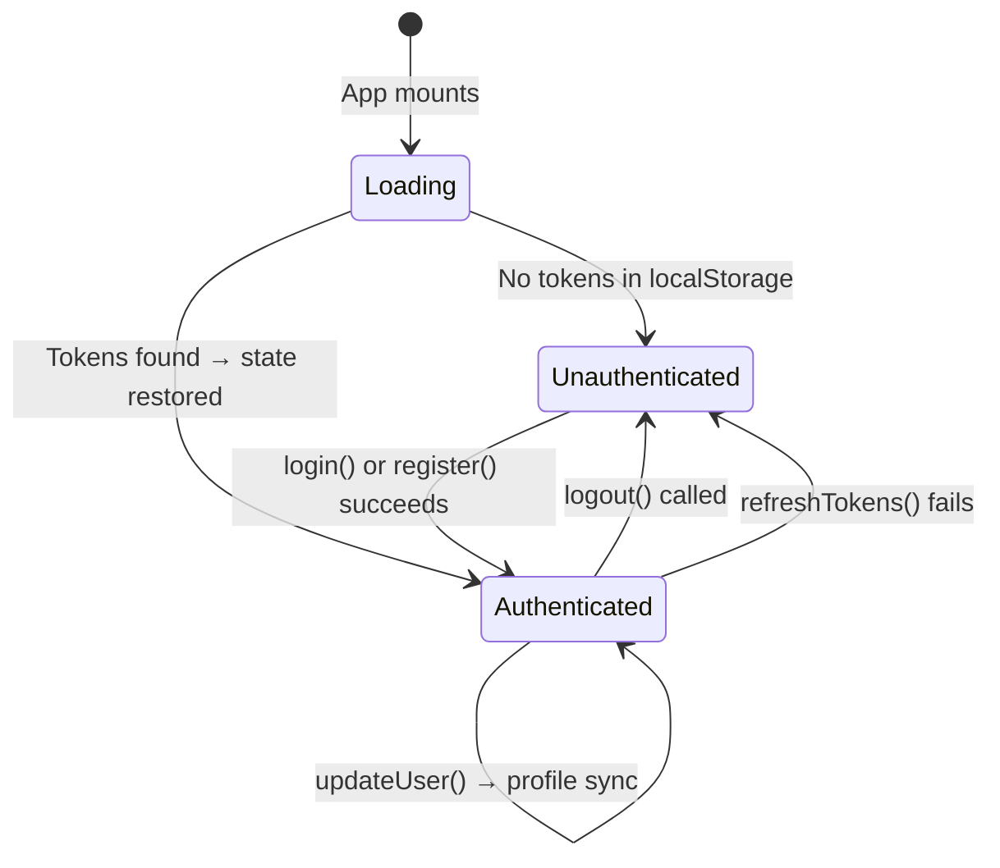
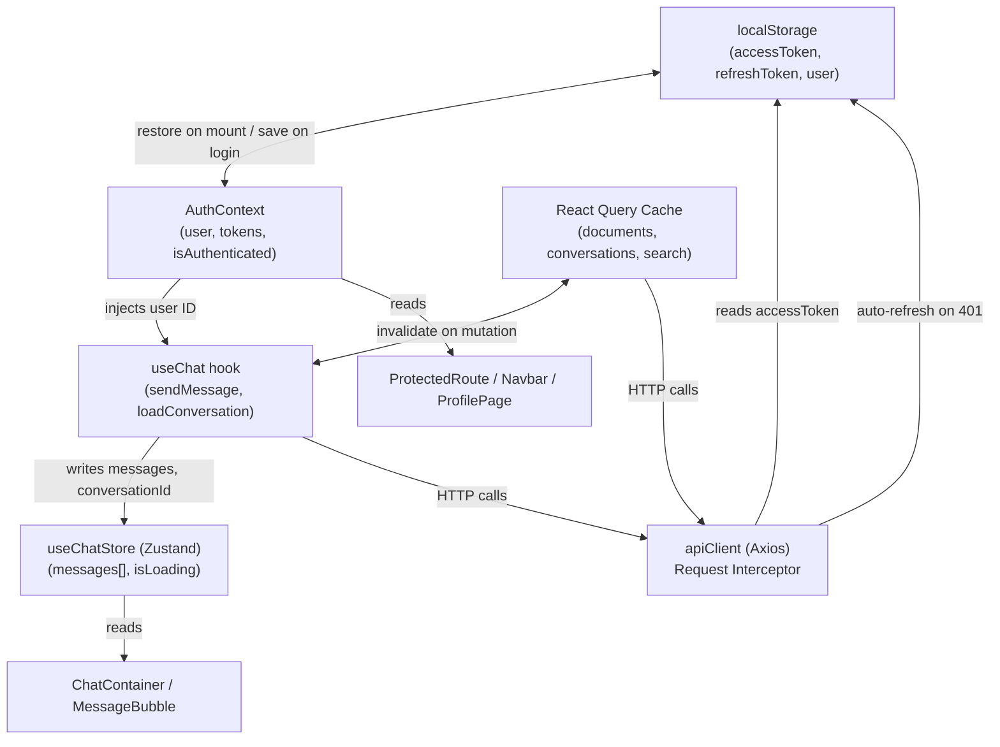

# ⚡ Docura Frontend: State Management Guide

> **Intelligence for Your Documents** — A complete reference for how client state is structured, shared, and persisted across the Docura SPA.

---

## Table of Contents
1. [State Architecture Philosophy](#1-state-architecture-philosophy)
2. [Authentication State — `AuthContext`](#2-authentication-state--authcontext)
3. [HTTP Client — `apiClient` (Axios)](#3-http-client--apiclient-axios)
4. [Auth Service — `authService.ts`](#4-auth-service--authservicets)
5. [Chat State — `useChatStore` (Zustand)](#5-chat-state--usechatstore-zustand)
6. [Server State — React Query (`@tanstack/react-query`)](#6-server-state--react-query-tanstackreact-query)
7. [State Interaction Diagram](#7-state-interaction-diagram)
8. [localStorage Key Reference](#8-localstorage-key-reference)

---

## 1. State Architecture Philosophy

Docura uses **two complementary state systems** — a deliberate choice to avoid the anti-pattern of mixing UI state with server cache:

| Concern | Tool | Why |
|---|---|---|
| **Auth identity** (tokens, user) | `AuthContext` + `localStorage` | Must persist across browser sessions |
| **Active chat messages** | `Zustand` (`useChatStore`) | Fast, synchronous UI updates during AI streaming |
| **Server data** (document list, conversation list) | React Query | Server-authoritative, cache invalidation on mutation |
| **HTTP transport** | Axios (`apiClient`) | Centralized interceptors for auth and error handling |

This separation means: React Query handles *what data exists on the server*, Zustand handles *what the user is currently doing*, and AuthContext handles *who is doing it*.

---

## 2. Authentication State — `AuthContext`

**File:** `src/contexts/AuthContext.tsx`

The `AuthContext` is the single source of truth for the authenticated user's identity throughout the app.

### State Shape

```typescript
interface AuthContextType {
  user: User | null;          // { id, name, email, role }
  accessToken: string | null; // JWT access token (24h TTL)
  refreshToken: string | null;// JWT refresh token (7d TTL)
  isAuthenticated: boolean;   // Derived: !!user
  loading: boolean;           // True during localStorage restore on mount
  login: (email, password) => Promise<void>;
  register: (name, email, password) => Promise<void>;
  logout: () => void;
  refreshTokens: () => Promise<void>;
  updateUser: (user: User) => void; // For profile edit sync
}
```

### Lifecycle



### localStorage Persistence

On every successful `login()`, `register()`, or `refreshTokens()`, the `saveTokens()` internal function synchronizes both React state AND `localStorage`:

```typescript
const saveTokens = (access: string, refresh: string, userData: User) => {
  setAccessToken(access);
  setRefreshToken(refresh);
  setUser(userData);

  localStorage.setItem('accessToken', access);
  localStorage.setItem('refreshToken', refresh);
  localStorage.setItem('user', JSON.stringify(userData));
};
```

On mount, a `useEffect` runs once to restore from `localStorage`, preventing a logged-in user from seeing the login screen on page reload:

```typescript
useEffect(() => {
  const savedAccessToken = localStorage.getItem('accessToken');
  const savedRefreshToken = localStorage.getItem('refreshToken');
  const savedUser = localStorage.getItem('user');
  if (savedAccessToken && savedRefreshToken && savedUser) {
    setAccessToken(savedAccessToken);
    setRefreshToken(savedRefreshToken);
    setUser(JSON.parse(savedUser));
  }
  setLoading(false); // ← ProtectedRoute waits for this
}, []);
```

### `updateUser()` — Profile Sync

When the user updates their name/email via `PUT /api/user/profile`, the `ProfilePage` calls `updateUser(updatedUser)`. This updates both in-memory state and `localStorage`, ensuring the Navbar immediately reflects the new name without re-login:

```typescript
const updateUser = (updatedUser: User) => {
  setUser(updatedUser);
  localStorage.setItem('user', JSON.stringify(updatedUser)); // Persist
};
```

### Error Handling — 429 Deduplication

The `login()` and `register()` functions deliberately skip showing their own error toast for `429` responses, because `axiosConfig.ts` already shows a rate-limit toast at the interceptor level. Double-toasting would be confusing to the user:

```typescript
if (error.response?.status !== 429) {
  toast.error(message); // Only show for non-rate-limit errors
}
```

---

## 3. HTTP Client — `apiClient` (Axios)

**File:** `src/api/axiosConfig.ts`

`apiClient` is a pre-configured Axios instance used for **all** API calls. Its base URL is `VITE_API_URL || '/api'`, which resolves to the Nginx reverse proxy in production.

### Request Interceptor

Automatically injects the `Authorization: Bearer <token>` header from `localStorage` on every request — except requests to `/auth/*` endpoints (which are public):

```typescript
if (accessToken && !config.url?.includes('/auth/')) {
  config.headers.Authorization = `Bearer ${accessToken}`;
}
```

### Response Interceptor — Queue-Based Token Refresh

The most complex part of the HTTP client is the concurrent refresh queue. It solves this problem: if 3 requests fire simultaneously and all get `401`, we should only call `POST /auth/refresh` **once** — not three times.

```
Request A → 401 → isRefreshing=true → call /auth/refresh → new token → retry A
Request B → 401 → isRefreshing=true → pushed to failedQueue
Request C → 401 → isRefreshing=true → pushed to failedQueue
                   ↓ refresh resolves ↓
                 processQueue(null, newToken)
                 → retry B + retry C with new token
```

```typescript
// Key variables (module-level singletons)
let isRefreshing = false;
let failedQueue: Array<{resolve, reject}> = [];

// On 401:
if (isRefreshing) {
  return new Promise((resolve, reject) => {
    failedQueue.push({ resolve, reject }); // Queue it
  }).then(token => {
    originalRequest.headers.Authorization = `Bearer ${token}`;
    return apiClient(originalRequest); // Retry with new token
  });
}
```

### Response Interceptor — Rate Limit Toast

When any request receives `429 Too Many Requests`, the interceptor reads the `retryAfter` seconds from the response body and shows a user-friendly toast notification:

```typescript
if (error.response?.status === 429) {
  const retryAfter = error.response.data?.retryAfter || 60;
  toast.error(`🚫 Rate limited! Please wait ${retryAfter} seconds before retrying.`, {
    duration: 5000
  });
}
```

---

## 4. Auth Service — `authService.ts`

**File:** `src/services/authService.ts`

A thin stateless module that wraps the `apiClient` HTTP calls for `/api/auth/*`. Its key responsibility is **DTO transformation**: the backend uses `snake_case` JSON, while the frontend uses `camelCase` TypeScript interfaces.

### `transformAuthResponse()` — The DTO Bridge

```typescript
// Backend response (snake_case)
interface BackendAuthResponse {
  access_token: string;
  refresh_token: string;
  user_id: number;
  email: string;
  name: string;
  role: string;
}

// Frontend type (camelCase)
interface AuthResponse {
  accessToken: string;
  refreshToken: string;
  user: User; // { id, email, name, role }
}

// Transformer
function transformAuthResponse(backend: BackendAuthResponse): AuthResponse {
  return {
    accessToken: backend.access_token,
    refreshToken: backend.refresh_token,
    user: {
      id: backend.user_id,
      email: backend.email,
      name: backend.name || backend.email.split('@')[0], // Fallback if name missing
      role: backend.role
    }
  };
}
```

The fallback `backend.email.split('@')[0]` ensures that even if the backend returns a `null` name (e.g., legacy data), the UI always has a displayable value.

### Exports

| Function | HTTP Call | Returns |
|---|---|---|
| `login(data)` | `POST /auth/login` | `AuthResponse` (transformed) |
| `register(data)` | `POST /auth/register` | `AuthResponse` (transformed) |
| `refreshTokens(token)` | `POST /auth/refresh` | `AuthResponse` (transformed) |
| `logout()` | — (no API call) | Clears `localStorage`, `void` |

---

## 5. Chat State — `useChatStore` (Zustand)

**File:** `src/store/chatStore.ts`  
**Test:** `src/store/chatStore.test.ts`

The Zustand store manages the **in-flight chat UI state** — the message thread currently visible on screen, the conversation thread ID, and the loading indicator.

### State Shape

```typescript
interface ChatState {
  messages: ChatMessage[];          // Ordered thread of Q&A messages
  conversationId: number | null;    // null = new conversation; ID = continuation
  isLoading: boolean;               // true while waiting for AI response
}

interface ChatMessage {
  id: string;            // UUID (client-generated) or server ID
  type: 'question' | 'answer';
  content: string;
  isLoading?: boolean;   // true = show Skeleton, false = show content
  sources?: Source[];    // Answer-only: linked document chunks
}
```

### Actions Reference

| Action | Signature | Description |
|---|---|---|
| `addMessage` | `(message: ChatMessage) => void` | Appends to message thread |
| `updateMessage` | `(id: string, updates: Partial<ChatMessage>) => void` | Patches a specific message (used to replace loading skeleton with real answer) |
| `setMessages` | `(messages: ChatMessage[]) => void` | Full replacement (used when loading a past conversation) |
| `setConversationId` | `(id: number \| null) => void` | Tracks which thread is active |
| `setLoading` | `(loading: boolean) => void` | Global loading flag |
| `clearChat` | `() => void` | Resets to initial state (new conversation) |

### Why Zustand Instead of React Query for Chat?

React Query is designed for *server-synchronized* data. The AI chat thread is inherently **optimistic and real-time** — we add the user's question to the UI *immediately*, before the server responds. We then show a skeleton, and finally replace it with the real answer. This mutable, sequential pattern is a natural fit for Zustand's synchronous state model.

---

## 6. Server State — React Query (`@tanstack/react-query`)

React Query manages all **server-owned** data: document lists, conversation histories, and search results.

### Query Key Convention

```typescript
// Documents
useQuery({ queryKey: ['documents'] })          // All user docs
useQuery({ queryKey: ['document', id] })        // Single doc

// Conversations
useQuery({ queryKey: ['conversations'] })        // Sidebar list
useQuery({ queryKey: ['conversation', id] })     // Single thread

// Search
useQuery({ queryKey: ['search', query, page] }) // Paginated results
```

### Cache Invalidation on Mutation

After every mutation (upload, delete, create conversation), the relevant cache key is invalidated to trigger a background re-fetch:

```typescript
// After document upload
queryClient.invalidateQueries({ queryKey: ['documents'] });

// After new message in a conversation
queryClient.invalidateQueries({ queryKey: ['conversations'] });
queryClient.invalidateQueries({ queryKey: ['conversation', conversationId] });
```

---

## 7. State Interaction Diagram



---

## 8. localStorage Key Reference

| Key | Type | Set By | Cleared By |
|---|---|---|---|
| `accessToken` | `string` | `authService.login/register/refreshTokens` → `AuthContext.saveTokens` | `authService.logout` / `axiosConfig` on refresh failure |
| `refreshToken` | `string` | Same as above | Same as above |
| `user` | `JSON string` | Same as above / `AuthContext.updateUser` | `authService.logout` / `axiosConfig` on refresh failure |
